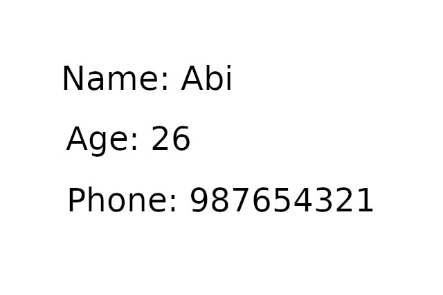
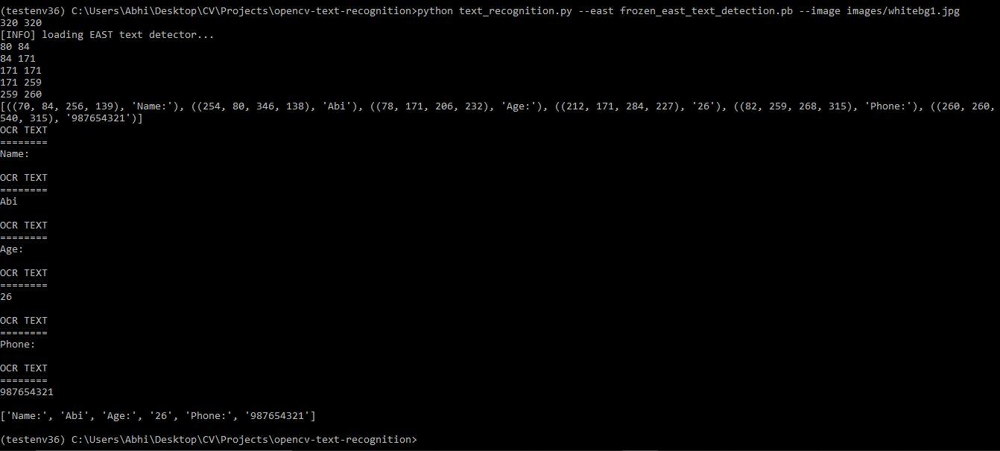

# Text Recognition
This model uses pretrained frozen east text detection model. Findng the bound boxes over the text in given image and getting the text from frozen east text detection model. Once all bounding boxes gets the text then the retrned text is organized in any particular use.

### Details - few things need to be done before to successfully run this model
1. Please download pretrained model 'frozen_east_text_detection.pb' which is around 90MB and keep it same directory as https://github.com/AbhinayReddyYarva/textRecognition/blob/master/text_recognition.py file. 
2. OpenCV should be greater than or '3.4.2' version.
3. Install pytesseract using pip or pip3
4. Only for windows - Download tesseract and install it from here https://github.com/UB-Mannheim/tesseract/wiki
5. Once tesseract is installed then find script file pytesseract.py from (anaconda environment - testenv36 ==> Mine) C:\Users\Abhi\Anaconda3\envs\testenv36\Lib\site-packages\pytesseract and open it. Change the following code from tesseract_cmd = 'tesseract' to tesseract_cmd = "C:\Program Files\Tesseract-OCR\Tesseract.exe"
6. Now code should work fine if not You may also need add environment variable C:\Program Files\Tesseract-OCR\

### How to run and use case
You can run below command in anaconda prompt in respective environment.
#### python text_recognition.py --east frozen_east_text_detection.pb --image images/whitebg1.jpg

Below is the console output for given image. I have sorted the final list from left to right and top to bottom by overcomming few problems with bounding boxes.

